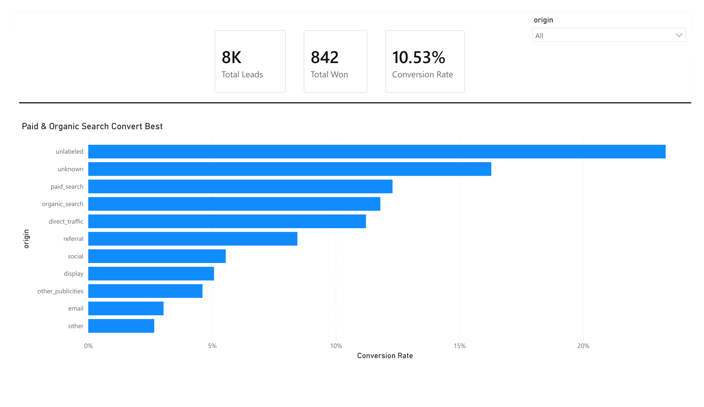
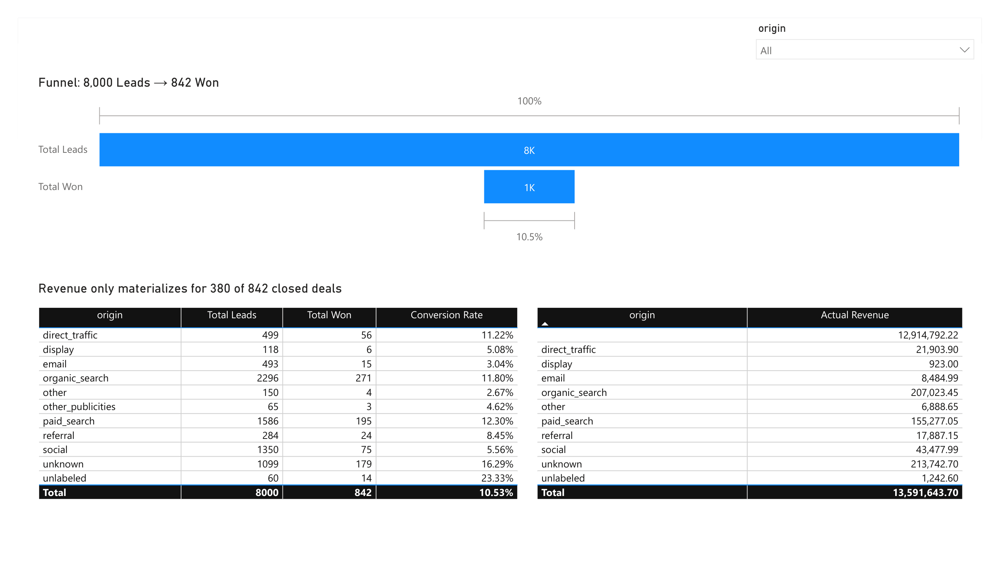

# Olist Marketing Funnel: Which Lead Channels Are Actually Worth the Spend?

**Tools Used:** Power Query (M) | Power BI | DAX
**Data:** [Marketing Funnel by Olist](https://www.kaggle.com/datasets/olistbr/marketing-funnel-olist) — 8,000 real, anonymized marketing-qualified leads (MQLs) from a Brazilian e-commerce marketplace, joined to order-level transaction data
**Links:** [Download the .pbix file](Olist_Marketing_Funnel_Revenue_Analysis.pbix) · [Dashboard PDF export](Olist_Marketing_Funnel_Revenue_Analysis.pdf) *(update these to your hosted GitHub/Drive links once uploaded)*

## Business Overview & Objective

Olist connects small sellers to major Brazilian marketplaces. Its marketing team generates thousands of leads (MQLs) per year from a mix of organic, paid, and referral channels, but not every lead becomes a seller — and not every seller who signs on ever lists a product.

**Core question:** Which lead sources are actually producing sellers who generate revenue, versus which ones are just adding volume without adding value?

**Questions answered:**
- What's the real MQL → Won conversion rate, and how does it vary by lead source?
- Of the leads that convert, which ones translate into actual marketplace revenue — not just a signed deal?
- Where is marketing spend being wasted on channels that convert poorly?

## Data Pipeline & Modeling

Raw data was pulled as four CSVs — marketing-qualified leads, closed deals, sellers, and order line items — and cleaned and joined entirely in **Power Query (M)**, then modeled and measured in **Power BI / DAX**. No pre-aggregation was done outside Power BI; all transformation logic is visible and auditable inside the .pbix file itself.

**Key cleaning and modeling steps:**
- Typed `first_contact_date` and `won_date` as dates; `declared_monthly_revenue` as decimal
- Distinguished between genuinely blank lead-origin values and the dataset's own `"unknown"` category, rather than collapsing them into one bucket — a small decision that preserved a real, distinct data-quality signal (see Limitations)
- Left-outer merged all 8,000 leads against the 842 closed deals, so unconverted leads stay in the model instead of disappearing — this is what makes it a funnel rather than just a list of wins
- Built a direct relationship from `ClosedDeals[seller_id]` → `order_items[seller_id]` (M:1, single-direction) to pull in *actual* transaction revenue per closed seller, separate from the self-reported `declared_monthly_revenue` figure captured at signup

**Core DAX measures:**
```DAX
Total Leads = COUNTROWS(Funnel)

Total Won = CALCULATE(COUNTROWS(Funnel), Funnel[Converted] = "Won")

Conversion Rate = DIVIDE([Total Won], [Total Leads], 0)

Avg Declared Revenue (Won) =
CALCULATE(AVERAGE(Funnel[declared_monthly_revenue]), Funnel[Converted] = "Won")

Actual Revenue (Closed Deal Sellers) =
CALCULATE(
    SUM(olist_order_items_dataset[price]),
    VALUES(ClosedDeals[seller_id])
)
```

## Dashboard Preview

The report is built as two pages:

**Executive Summary** — headline KPI cards (Total Leads, Total Won, Conversion Rate), and the primary chart, titled to lead with the finding rather than the field name: *"Paid & Organic Search Convert Best."*

**Deep Dive** — the funnel (8,000 → 842, 10.5%), plus the origin-level conversion and revenue tables side by side, so a channel's conversion rate and its actual revenue can be scanned together in one view.





The full interactive report is available as a downloadable `.pbix` file — open it in the free Power BI Desktop app to explore the model, filters, and DAX measures directly. A static PDF export is also available for anyone who wants the visuals without opening Power BI.

## Key Insights

1. **Overall MQL → Won conversion is 10.53%** (842 of 8,000 leads), which sets the baseline every channel is measured against.

2. **Paid search and organic search are the strongest actionable channels** — paid_search converts at 12.30% and organic_search at 11.80%, both above baseline, with comparable average revenue per closed deal (~$764–$796). These are the channels worth protecting or growing.

3. **Email and display are underperforming on both volume and quality.** Email converts at just 3.04% (15 of 493 leads) and display at 5.08% (6 of 118) — both well below the 10.53% baseline, with the lowest average revenue per deal among the meaningfully-sized channels. This is the clearest "reduce or rework" signal in the data.

4. **More than half of closed deals never generate revenue at all.** Of the 842 sellers who "won," only 380 (45%) ever sold a single product. The other 462 — 55% — closed the deal and then generated $0 in tracked revenue. This matters more than the conversion-rate story: a channel can convert leads into signed sellers and still fail the business if those sellers never activate.

5. **Attributable funnel revenue is $676,851 against a total platform revenue of $13.59M.** The marketing funnel accounts for roughly 5% of all marketplace transaction revenue — a useful scope check before making any ROI claim, since most of Olist's actual revenue comes from sellers who never passed through this funnel at all.

## Strategic Recommendations

- **Reallocate budget away from email and display toward paid_search and organic_search**, where both conversion rate and revenue-per-deal are stronger.
- **Investigate the post-close onboarding gap.** A 55% "won but never sold" rate suggests the problem isn't lead generation — it's what happens after a deal closes. This is worth a follow-up analysis on its own (time-to-first-listing, onboarding friction, etc.).
- **Fix origin tracking before trusting it further.** Roughly 14% of leads (1,099 of 8,000) came through with `origin = unknown` or blank. Until that's resolved, any channel-level recommendation carries a real blind spot.

## Limitations & Data Quality Notes

Being upfront about what this analysis can't tell you:

- **Only two funnel stages are tracked** (contacted → won), not a full MQL → SQL → Opportunity → Won pipeline. The conversion story here is real but coarser than a multi-stage CRM funnel would allow.
- **~14% of leads have no reliable origin.** Interestingly, this "unknown" bucket actually converts *better* than most labeled channels (16.29%) — but since it isn't actionable (you can't increase spend on an unlabeled channel), it's flagged here rather than treated as a recommendation.
- **Revenue figures reflect item price only**, excluding freight and any returns/cancellations.
- **The "other" origin category has only 4 won deals** — too small a sample to draw a reliable conclusion from, despite showing the highest average revenue per deal in the raw numbers.

## What I'd Do With More Data

A production version of this analysis would benefit from full opportunity-stage timestamps (to measure time-to-close, not just win/loss), marketing spend by channel (to calculate true ROI rather than just conversion rate and revenue), and a resolved source for the unknown-origin leads.
